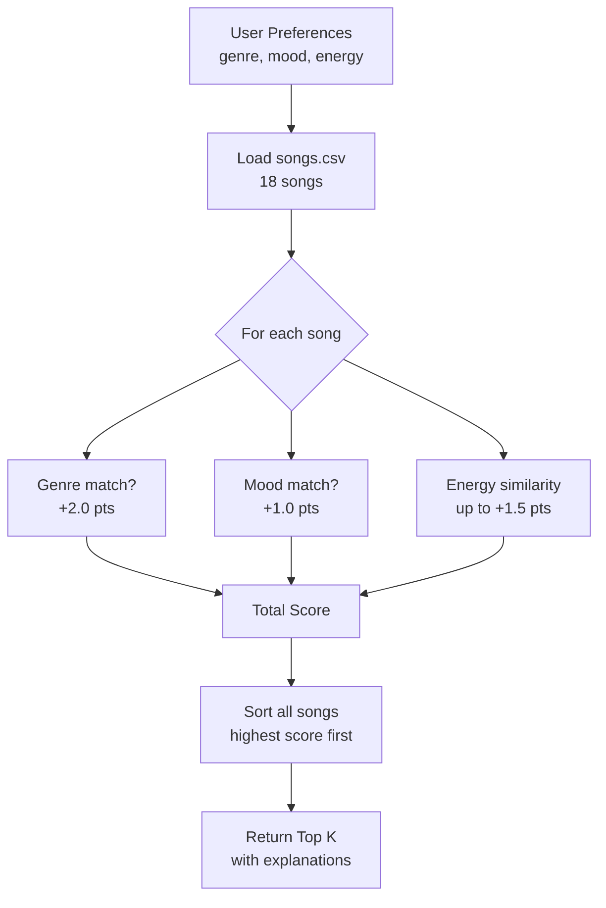

# Music Recommender Simulation

## Project Summary

This project is a simplified music recommender system built in Python. It loads a catalog of 18 songs from a CSV file, scores each song against a user's taste profile, and returns a ranked list of the top K recommendations with explanations. The system mirrors the core ideas behind real-world recommenders like Spotify's "Discover Weekly" — but using plain math instead of machine learning.

---

## How The System Works

### Song Features

Each song in `data/songs.csv` has the following features:
- **genre** — e.g., pop, rock, lofi, hip-hop, classical
- **mood** — e.g., happy, chill, intense, romantic, nostalgic
- **energy** — a float from 0.0 (very calm) to 1.0 (very intense)
- **tempo_bpm** — beats per minute
- **valence** — how "positive" a song sounds (0.0 = dark, 1.0 = bright)
- **danceability** — how suited it is for dancing
- **acousticness** — how acoustic vs. electronic it sounds

### User Profile

The user profile is a dictionary with:
- `genre` — the user's preferred genre
- `mood` — the user's preferred mood
- `energy` — the user's target energy level (0.0–1.0)

The `UserProfile` dataclass also includes a `likes_acoustic` boolean for the OOP interface.

### Algorithm Recipe (Scoring Logic)

For every song in the catalog, the system computes a score using these rules:

| Rule | Points |
|------|--------|
| Genre matches user's favorite genre | +2.0 |
| Mood matches user's favorite mood | +1.0 |
| Energy is close to user's target energy | up to +1.5 (scaled by proximity) |

**Energy scoring formula:** `1.5 × (1 - |song.energy - user.target_energy|)`

This means a perfect energy match gives +1.5, and a song at the opposite end of the scale gives +0.0.

**Potential bias note:** Genre is weighted twice as heavily as mood. This means two songs with the same energy and mood but different genres will have very different scores. The system might ignore a great mood match in a non-preferred genre, which could be unfair to listeners with flexible genre tastes.

### Flowchart



---

## Getting Started

### Setup

1. Create a virtual environment (optional but recommended):

   ```bash
   python -m venv .venv
   source .venv/bin/activate      # Mac or Linux
   .venv\Scripts\activate         # Windows
   ```

2. Install dependencies:

   ```bash
   pip install -r requirements.txt
   ```

3. Run the app:

   ```bash
   python -m src.main
   ```

### Running Tests

```bash
pytest
```

---

## Experiments You Tried

### Profile 1: High-Energy Pop Fan
- **Settings:** genre=pop, mood=happy, energy=0.8
- **Top result:** Sunrise City (Neon Echo) — genre + mood + energy all matched
- **Observation:** The pop songs consistently rose to the top. Made sense intuitively.

### Profile 2: Chill Lofi Listener
- **Settings:** genre=lofi, mood=chill, energy=0.35
- **Top results:** Library Rain and Midnight Coding dominated — both lofi/chill
- **Observation:** The low energy target pushed ambient and folk songs up too.

### Profile 3: Deep Intense Rock Fan
- **Settings:** genre=rock, mood=intense, energy=0.9
- **Top result:** Storm Runner — perfect match on all three dimensions
- **Surprise:** Gym Hero (pop/intense/0.93) scored second because its energy was close and mood matched, even with the genre mismatch.

### Experiment: Halving Genre Weight
- Changed genre match from +2.0 to +1.0 points
- **Result:** The rankings became much more energy-driven. The chill profile's top pick shifted from a lofi track to an ambient track because ambient had a slightly closer energy score.
- **Takeaway:** Genre weight strongly shapes results. Reducing it makes the system more "vibe-first."

---

## Limitations and Risks

- Works only on a small catalog of 18 songs
- Does not consider lyrics, artist familiarity, or listening history
- May over-prioritize genre since it carries double the weight of mood
- Energy scoring is linear — it doesn't know that 0.7 and 0.8 are both "high energy"
- The dataset skews toward Western pop/rock genres, meaning reggae, classical, and folk users get fewer good matches

---

## Reflection

Read and complete `model_card.md`:

[**Model Card**](model_card.md)

Building this recommender showed me how much a simple scoring formula can shape what a system "prefers." Even with just three features, the weights I chose determined whether the system felt like a genre guide or a vibe guide. Real recommenders like Spotify use hundreds of features and collaborative filtering (matching you to users who listen similarly), but the core idea — turn preferences into a number, sort, return the top — is the same.

Bias surprised me most. Because genre has a 2x weight, the system effectively ignores great mood and energy matches in unfamiliar genres. A "chill" listener might love a slow country ballad, but if their profile says `genre=lofi`, they'll never see it. That's a real problem in production recommenders too: users get trapped in genre bubbles they never asked for.
